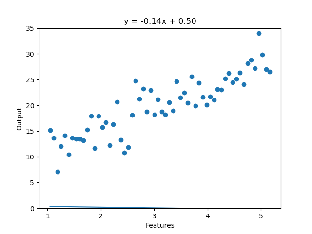
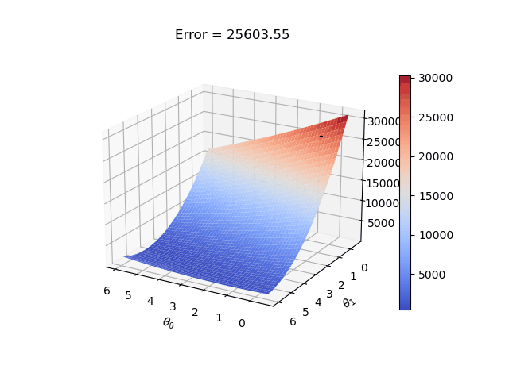
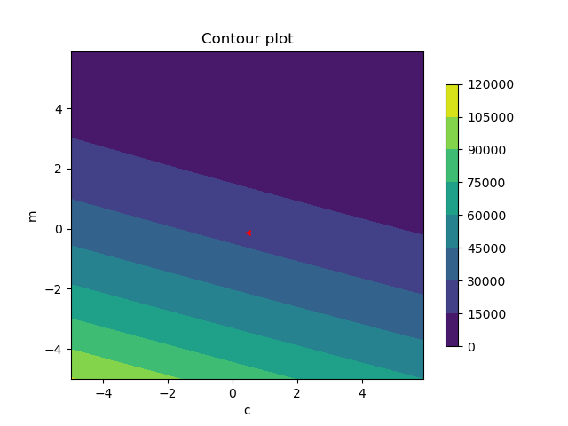

# ES654-2022 Assignment 2

*Aadesh Desai, Eshan Gujarathu, Vishal Soni* - *19110116, 19110082, 19110207*

------

> The three gifs are plotted for 10 iterations where c and m are two parameters (t_0 and t_1).

# Line plot:

    > Plot fit of the line (y vs. X plot) based on chosen value of t_0, t_1.

    > On increasing iterations the line fit moves towards better prediction.

# Surface plot:

    > Plot of RSS (residual sum of squares) in 3D ans this surface plot is obtained by varying theta_0 and theta_1 over a range.

    > On increasing iterations the error reduces we move towards more optimal solution.

# Contour plot:

    > A contour plot is obtained by varying theta_0 and theta_1 over a range, arrow in the contour is the RSS (residual sum of squares) based on given value of t_0 and t_1 on increasing iterations in the direction of gradient steps.
