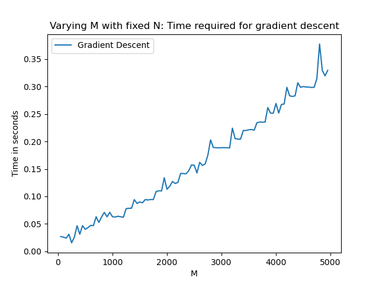
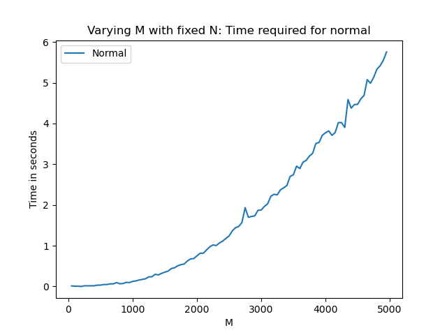
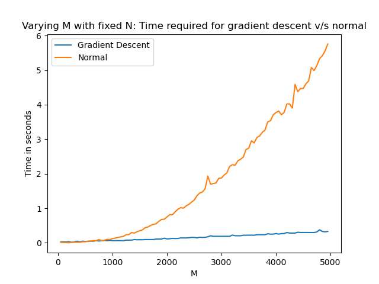
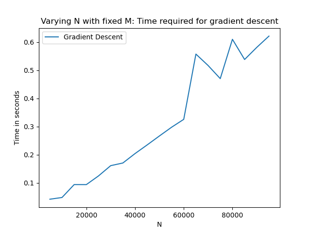
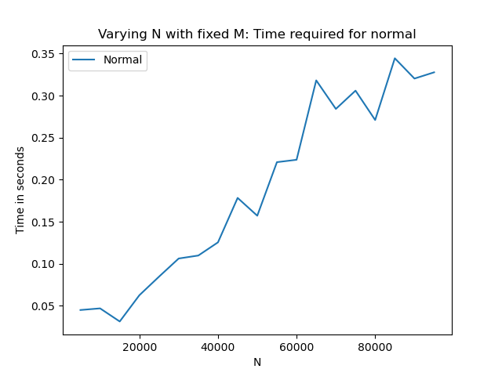
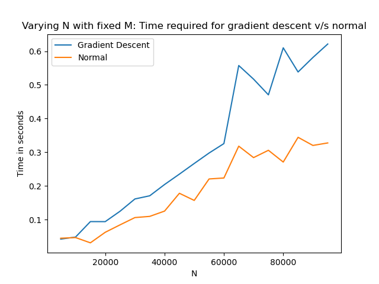
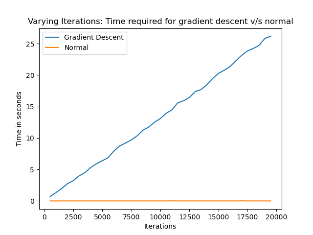

# ES654-2022 Assignment 2

*Aadesh Desai, Eshan Gujarathu, Vishal Soni* - *19110116, 19110082, 19110207*

------

>In this question the data of question 5 is to do some experiments on the runtime complexity of Gradient Descent and Normal Equations.

# Theoretical time complexity: 
    1) Gradient Descent: O((t+N) D^2) 
    2) Normal Equation: O(D^2 N) + O(D^3)

# Case 1) 
In this experiment we first Vary M(number of features) and keep N(number of samples) and number of iterations fixed to plot the time taken for learning the model.

* # Varying M 
In this the values of M is varied from (50 to 5000 in interval of 50) and N is kept constant at 6000, batch size at 1 and number of iterations to 10.

For our algorithm, we obtain the following plots:

* ## Plots of Training time

Time taken in Gradient Descent vs No. of Features (M)             |  Time taken in Normal Equation vs No. of Features (M)
:-------------------------:|:-------------------------:
  |  

Comparing both Gradient Descent and Normal Equation time in same plot

Time taken in (Gradient Descent Vs Normal Equation) vs No. of Features (M)

 

### Observations

    > We observe that the fitting time increases with increasing M and the increase is cubic in case of normal and quadratic in case of gradient descent, which matches the theoretical values.

    > Hence we observe that in common plot above the training time for normal method is greater than the training time for gradient descent.

# Case 2) 
In this experiment we Vary  N(number of samples) and keep M(number of features), number of iterations fixed to plot the time taken for learning the model.

* # Varying N
In this the values of N is varied from (5000 to 100000 in interval of 5000) and N is kept constant at 500, batch size at 1 and number of iterations to 10.

For our algorithm, we obtain the following plots:

* ## Plots of Training time

Time taken in Gradient Descent vs No. of Samples (N)             |  Time taken in Normal Equation vs No. of Samples (N)
:-------------------------:|:-------------------------:
  |  

Comparing both Gradient Descent and Normal Equation time in same plot:

Time taken in (Gradient Descent Vs Normal Equation) vs No. of Samples (N)

 

### Observations

    > We observe that the fitting time increases with increasing N and the increase is linear in case of normal and gradient descent, which matches the theoretical values.

    > Hence we observe that in common plot above the training time for normal method and training time for gradient descent is almost similar with normal time being smaller than gradient descent as for small M at larger N D^3 will be samller.

# Case 3) 
In this experiment we Vary number of iterations and keep N(number of samples), M(number of features) fixed to plot the time taken for learning the model.

* # Varying Iterations
In this the values of iterations is varied from (500 to 20000 in interval of 500) and N is kept constant at 10, M is kept constant at 5, batch size at 1.

For our algorithm, we obtain the following plots:

* ## Plots of Training time

Comparing both Gradient Descent and Normal Equation time in same plot:

Time taken in (Gradient Descent Vs Normal Equation) vs No. of Iterations

 

### Observations

    > We observe that the fitting time increases with increasing iterations for the case of gradient descent as it depends linearaly and in case of normal it does not depend at all, which matches the theoretical values.

    > Hence we observe that in plot above the training time for normal method is almost same for all iterations and nearly 0 as values od N and M are small.
